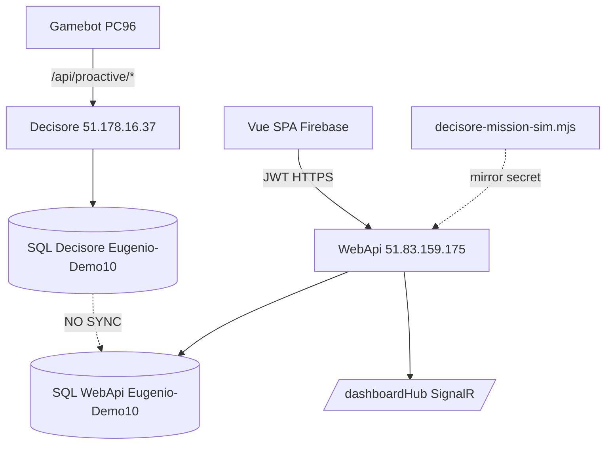

# Audit TradingDashboard-2a

**Repo operativo:** [eugeniorossi2025-sudo/TradingDashboard-2a](https://github.com/eugeniorossi2025-sudo/TradingDashboard-2a)  
**Branch principale:** `main` (HEAD `124a20e` al momento dell'audit)  
**Clone locale:** `C:\Users\eugen\Desktop\NuovaDashboard-MarcoTurri`  
**Data audit:** 2026-05-25  
**Modalità:** sola lettura — nessuna modifica al codice sorgente (solo questo documento).

---

## 1. Executive summary

TradingDashboard-2a (DASH2A) è uno **stack Vue 3 + WebApi .NET 9 + Decisore separato**, non il modello DASH1 (`TableAdvices` / `/tradingHub` / `v2/bots`).

**Problema strutturale #1:** due database isolati — bot → Decisore (`51.178.16.37`) scrive `Pc_CurrentStatus` sul **proprio SQL**; WebApi (`51.83.159.175`) legge `Pc_CurrentStatus` sul **SQL locale** (0 righe al check infra). **Nessuna sync automatica.**

**Problema strutturale #2:** frontend e backend **non allineati** su reset/emergency, swagger stale, SignalR payload vs UI.

**Problema deploy #3:** prod backend fermo a commit **`7a81f83`** (25 mag 12:20). I commit successivi (HTTPS, mirror collaudo, fix margine, fix smoke test) **non sono in produzione** — tutti i deploy backend falliti con rollback.

| Componente | Stato prod (25 mag) | Commit probabile |
|------------|---------------------|------------------|
| Backend IIS | **Vecchio** — `7a81f83` | Ultimo deploy OK |
| Frontend Firebase | **Nuovo** — HTTPS API | `bd6c322`…`fc20f73` |
| Decisore | **Separato**, no CI nel repo | Manuale su `51.178.16.37` |

---

## 2. Struttura repo

```text
TradingDashboard-2a/
├── backend/           WebApi .NET 9 + Entities + WebSite legacy ASPX
├── frontend/          Vue 3 + PrimeVue (Sakai)
├── decision-engine/   Decisore (/api/proactive)
├── chrome-extension/  Automazione casino (isolata)
├── ops/               Deploy, readiness, HTTPS
├── tools/             Collaudo, smoke, sim PC96
├── config/            Placeholder (.gitkeep)
├── DASH2A-INFRASTRUCTURE.md
└── restart-app-safe.ps1
```

**Branch attivi:** `main`, `feature/mobile-financial-reports`, `marco-dash`, vari backup locali.

**Tag / GitHub Releases:** nessuna.

---

## 3. Architettura runtime



**Regola documentata:** Vue → WebApi → SQL locale. **Non** Decisore per dati dashboard.  
**Realtà bot:** bot scrive solo su Decisore → dati **non arrivano** alla dashboard senza mirror manuale o bridge.

---

## 4. Backend WebApi

### 4.1 Endpoint esposti (codice `main`)

| Controller | Route principali | Auth |
|------------|------------------|------|
| `AuthController` | `POST /api/Auth/login`, reset password, `GET /test` | Anonimo |
| `DashboardController` | `GET /data`, `/tables`, `/chart`, `/updates` | JWT |
| `CollaudoController` | `POST /mirror-pc-status`, `GET /pc-status/{pc}` | Header secret |
| `DeciderController` | `GET /api/decider/config`, `/health` | JWT (sonda) |
| `ConfigurationController` | CRUD `/api/Configuration` | JWT |
| `MissionController` | Report missioni JSON/HTML/CSV | JWT |
| `RuntimeModeController` | `GET/PUT /api/runtime-mode` | JWT / Admin |
| `LogController`, `DeviceController`, `UserController`, `AdminUsersController` | CRUD admin | JWT / Admin |

### 4.2 Assenti (frontend/swagger li aspettano)

- `POST /api/Dashboard/reset-tables`
- `POST /api/Dashboard/emergency-stop`
- `GET /api/Dashboard/pc-current-status`, `/margini-chart`
- `/api/botsession/*`
- `/api/push/*`
- `/api/LegacyBot/sync`
- **`/api/dashboard/v2/bots`**, **`/tradingHub`**, **`/api/mission/current`**, **`/api/strategy`** — **non esistono** (sono DASH1, non DASH2A)

### 4.3 DashboardService

Legge **solo** `Pc_CurrentStatus` via EF Core — nessuna SP, nessuna tabella `Values` o `TableAdvices`.

File: `backend/WebApi/Services/Implementations/DashboardService.cs`

**Mapping incompleto:** molti campi DTO (`HotZone`, `FutureL5Pred`, …) non popolati; `DtUltimo` = `LastUpdate` (ignora `DT_ULTIMO` DB); chart = snapshot istantaneo, non serie storica.

### 4.4 SignalR

| Item | Valore |
|------|--------|
| Hub | `/dashboardHub` (prod risponde 200 su negotiate) |
| Frequenza | 1.5s |
| **Prod (`7a81f83`)** | `ReceiveDashboardUpdate` → **solo `DashboardStatistics`** |
| **HEAD (`main`)** | `ReceiveDashboardUpdate` → **`DashboardResponse` completo** (tables + chart + stats) — **non deployato** |
| `ReceiveDashboardChartUpdate` | **Mai inviato** |

### 4.5 Auth

JWT HS256 da `POST /api/Auth/login`. Admin seed da `Admin:*` in config. Hub `[AllowAnonymous]` ma accetta token via query `access_token`.

### 4.6 CommandService (interno, non esposto)

`StopPcAsync`, `ResetMartingaleAsync`, `StartPcAsync` scrivono tabella `Commands` — **nessun controller REST** e SignalR `ExecuteCommand` è stub (firma diversa dal frontend).

### 4.7 Collaudo mirror (solo su `main`, non in prod)

- `POST /api/Collaudo/mirror-pc-status` → upsert `Pc_CurrentStatus` via SP
- Secret: `Collaudo:MirrorSecret` / env `Collaudo__MirrorSecret`
- In `appsettings.json` default: **stringa vuota** → 503 se non configurato
- Aggiunto in commit `0250d58` — **assente su prod** (`7a81f83`)

### 4.8 Config e sicurezza

- Prod DB: `51.83.159.175` / `Eugenio-Demo10` / `sa3`
- Decider default: `http://51.178.16.37/api/proactive`
- **Credenziali SMTP/JWT/DB committate** in `appsettings.json` (rischio)

---

## 5. Frontend Vue

### 5.1 Stack e URL

- Vue 3.4 + PrimeVue 4 + Vite 5
- `VITE_API_BASE_URL` default: `http://localhost:5299`
- Prod Firebase: `https://eugenio-dashboard-2a.web.app` → API `https://vps-b0942869.vps.ovh.net`
- Login: `https://eugenio-dashboard-2a.web.app/auth/login`
- Root Owner: `https://eugenio-dashboard-2a.web.app/admin/root-owner` (non `eugenio-dashboard-2.web.app` — Site Not Found)

### 5.2 API usate (funzionanti)

- `GET /api/Dashboard/data`, `/chart` — OK se JWT + righe in DB
- Auth, Configuration, Log, Device, User, Mission reports, runtime-mode — implementati

### 5.3 Rotte rotte / disabilitate

| UI | Problema |
|----|----------|
| Reset dashboard | `DashboardService.resetDashboard()` **lancia errore esplicito** |
| Emergency stop | `stopDashboard()` **lancia errore esplicito** |
| BotSessions | `featureDisabled = true`; `/api/botsession/*` assente |
| Push (AdminMobileLive) | `/api/push/*` assente → 404 |
| Console SignalR | `ExecuteCommand` payload **non compatibile** col hub |

File: `frontend/src/service/DashboardService.ts`

### 5.4 Tabella bot (`TableBots.vue`)

- Conta bot attivi con `isOnline(dtUltimo)`: timestamp + **1 ora** offset, finestra **5 minuti**
- Aspetta `computer`, `lastAdvice`, `margine`, `dtUltimo`, …
- Se DB vuoto o SignalR manda solo stats → **0 bot attivi**, tabella vuota

### 5.5 Swagger drift

`frontend/src/api/swagger.json` **obsoleto** — mancano `/api/Dashboard/data`, mission, admin; contiene endpoint legacy (`reset-tables`, `pc-current-status`) non presenti nel backend.

---

## 6. Decisore (`decision-engine/`)

| Endpoint | Uso |
|----------|-----|
| `GET/POST /api/proactive/decide`, `update-params`, `update-deck`, `get-global-profit`, `bot-app-config` | Runtime bot |
| `GET /api/proactive/reset`, `/emergency-stop` | Ops |

- **Prod attivo:** `http://51.178.16.37` (probe `/reset` → 200)
- **Repo `appsettings.json`:** ancora `51.210.181.37` (**obsoleto**)
- **Nessun workflow CI** per deploy Decisore
- **Nessun SignalR**
- Startup: può cancellare `Pc_CurrentStatus` al restart

---

## 7. CI/CD e stato produzione

### 7.1 Workflow principali (manual dispatch)

| Workflow | Target |
|----------|--------|
| `deploy-backend-dash2a.yml` | IIS swap `C:\inetpub\wwwroot\releases\backend-*` |
| `firebase-hosting-merge.yml` | Firebase `eugenio-dashboard-2a` |
| `enable-backend-https.yml` | HTTPS Let's Encrypt |

Runner: self-hosted `dash2a-backend-runner-01` su `51.83.159.175`.

### 7.2 Deploy backend — ultimi run

| SHA | Esito | Nota |
|-----|-------|------|
| `124a20e` | **FAIL** | smoke test HTTPS |
| `b2e51bb` | **FAIL** | idem |
| `0250d58` | **FAIL** | mirror collaudo non in prod |
| **`7a81f83`** | **OK** | **← backend prod attuale** |
| `d5e8630` | OK | deploy precedente |

**8 commit** tra prod e HEAD non deployati (HTTPS backend, mirror, fix margine, fix smoke).

### 7.3 Frontend Firebase

Deploy **OK** (25 mag) — frontend più avanzato del backend.

### 7.4 Probe live (25 mag)

| Endpoint | Risultato |
|----------|-----------|
| `GET http://51.83.159.175/api/Auth/test` | **200** JSON |
| `POST /dashboardHub/negotiate` | **200** |
| `GET /api/dashboard/v2/bots` | **404** |
| `GET /tradingHub/negotiate` | **404** |
| `GET /api/mission/current` | **404** |
| `GET /api/Dashboard/data` | **401** (esiste, richiede JWT) |

---

## 8. Flusso dati bot → dashboard

| Step | Stato |
|------|-------|
| Bot → Decisore | OK (path separato) |
| Decisore → SQL Decisore | OK |
| SQL Decisore → WebApi | **Assente** |
| WebApi → Vue HTTP | OK se righe in DB WebApi |
| WebApi → Vue SignalR | **Prod: solo stats** — tabella non aggiornata live |
| Mirror collaudo | Solo su `main`, non deployato |

**Pc_CurrentStatus su DB WebApi prod:** **0 righe** (infra check) → dashboard sempre vuota per bot reali.

---

## 9. Elenco problemi (priorità)

| ID | Severità | Problema |
|----|----------|----------|
| **P1** | Critico | **Split DB** Decisore vs WebApi — bot non alimenta dashboard |
| **P2** | Critico | **Prod backend stale** — `7a81f83` vs HEAD; deploy falliti |
| **P3** | Critico | **SignalR prod** invia stats, UI vuole righe tabella |
| **P4** | Alto | Reset / emergency **non implementati** su WebApi |
| **P5** | Alto | Frontend Firebase **HTTPS** → backend potenzialmente mismatch pre-HTTPS commit |
| **P6** | Alto | `swagger.json` stale — client generato fuori sync |
| **P7** | Medio | `CommandService` esiste ma non collegato a UI |
| **P8** | Medio | Decisore repo config IP obsoleto; no CI deploy |
| **P9** | Medio | Collaudo mirror su `main` non in prod; secret vuoto |
| **P10** | Medio | `restart-app-safe.ps1` check Firebase ID errato (`2` vs `2a`) |
| **P11** | Basso | WebSite ASPX legacy coesiste con WebApi (path alternativo) |
| **P12** | Info | Chrome extension isolata — OK per design |

---

## 10. Cosa funziona oggi

- Login JWT + pagine admin (User, Log, Configuration, Device)
- Mission reports API
- Decisore prod `/api/proactive/*` su `51.178.16.37`
- Frontend Firebase live con routing SPA
- Backend prod risponde (`/api/Auth/test`, `/dashboardHub`)
- Stack locale `LocalProdLike` + script collaudo (`tools/collaudo-*.mjs`, `decisore-mission-sim.mjs`)

---

## 11. Cosa non funziona / non è allineato

- Dashboard live con bot PC96 reali (DB vuoto + no sync)
- Tabella bot in tempo reale su prod (SignalR stats-only)
- Reset / emergency dalla UI Vue
- Deploy automatico degli ultimi fix su `main`
- Parità con DASH1 (`v2/bots`, `tradingHub`, `TableAdvices`, strategy/mission current) — **non prevista in questo repo**

---

## 12. Prossimi passi consigliati (fase 2)

Ordine logico per **sistemare** TradingDashboard-2a:

1. **Scegliere una pipeline dati unica** — sync Decisore→WebApi DB, oppure bot che scrive anche su WebApi, oppure mirror operativo (non solo collaudo).
2. **Allineare locale** — `restart-app-safe.ps1 -Run`, verificare PC96 via mirror o dati seed.
3. **Fix deploy smoke test** — far passare `124a20e` o cherry-pick fix senza rompere rollback.
4. **Allineare frontend/backend** — reset/emergency, swagger refresh, SignalR payload.
5. **Solo dopo locale OK** — deploy prod.

---

## 13. File chiave

| Area | Path nel repo |
|------|---------------|
| Dashboard API | `backend/WebApi/Controllers/DashboardController.cs` |
| Dashboard data | `backend/WebApi/Services/Implementations/DashboardService.cs` |
| SignalR push | `backend/WebApi/Services/Implementations/DashboardUpdateService.cs` |
| Collaudo | `backend/WebApi/Controllers/CollaudoController.cs` |
| Vue dashboard | `frontend/src/views/Dashboard.vue` |
| Bot table | `frontend/src/components/dashboard/TableBots.vue` |
| Decisore | `decision-engine/Decisore/Controllers/EngineController.cs` |
| Infra | `DASH2A-INFRASTRUCTURE.md` |
| Deploy | `ops/dash2a-readiness/deploy-backend-safe.ps1` |
| Local start | `restart-app-safe.ps1` |

---

## 14. Conclusione

TradingDashboard-2a è il **repo operativo corretto**, ma **non è deployabile/funzionante end-to-end** così com'è in prod: il gap principale è **datasource bot (Decisore) scollegato dalla dashboard (WebApi)**, aggravato da **deploy backend bloccato** e **SignalR/reset non allineati col frontend**.

---

*Fine audit — nessun file sorgente modificato oltre a questo documento.*
