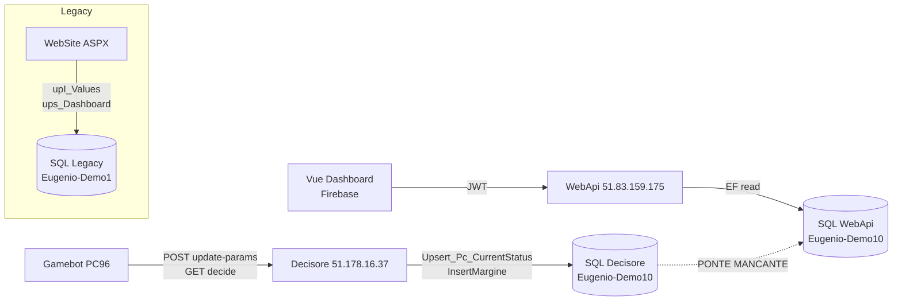

# MAPPA ARCHITETTURA — eugenio_codice_completo.zip

**Fonte analizzata:** `C:\Users\eugen\Desktop\BOTITALIA\eugenio_codice_completo`  
**Data analisi:** 2026-05-25  
**Modalità:** sola lettura — nessuna modifica al codice sorgente, nessun Decisore toccato.

---

## 1. Flusso reale nello ZIP

```text
BOT
  eugenio-bot (Gamebot.exe)
  └─ HTTP /api/proactive/* su Dashboard.Url

DECISORE (51.178.16.37 prod / 51.210.181.37 nello ZIP — obsoleto)
  eugenio-decisore
  └─ scrive Pc_CurrentStatus, Margini, Statistiche su SQL Decisore

DASHBOARD BACKEND (WebApi)
  eugenio-dashboard-back-end/WebApi
  └─ legge tabella [Values] su SQL WebApi (host DIVERSO)
  └─ NON legge Pc_CurrentStatus

DASHBOARD FRONTEND (Vue)
  eugenio-dashboard-front-end
  └─ si aspetta PcCurrentStatus, reset, emergency, margini-chart
  └─ backend nello ZIP espone /data /updates /tables /chart — shape diversa

LEGACY DASHBOARD
  eugenio-dashboard-back-end/WebSite (ASPX VB)
  └─ SP ups_Dashboard, UpI_Commands, UpD_Values
  └─ era il ponte storico verso Pc_CurrentStatus

CHROME EXTENSION
  eugenio-chrome-extension
  └─ automazione casino, isolata, nessuna API dashboard
```

---

## 2. Frontend (`eugenio-dashboard-front-end`)

**Stack:** Vue 3 · Vite · PrimeVue · TypeScript · SignalR · OpenAPI client  
**Deploy ZIP:** Firebase → `eugenio-dashboard-1`

### Pagine / route

| Area | Componente |
|---|---|
| Dashboard live | `src/views/Dashboard.vue` |
| Login | `src/views/pages/auth/Login.vue` |
| Admin utenti | `User.vue`, `RolesPermissions.vue` |
| Configurazioni | `Configuration.vue` |
| PC / Device | `PCManagment.vue` |
| Log | `Log.vue` |
| Console comandi | `Console.vue` |
| Bot sessions | `BotSessions.vue` |

Non esistono app "mobile" o "client" separate — è una SPA responsive.

### API chiamate dal frontend (contratto swagger/client generato)

```text
POST /api/Auth/login
POST /api/Auth/logout
POST /api/Auth/reset-password-request
POST /api/Auth/reset-password-confirm

GET  /api/Dashboard/pc-current-status     ← endpoint NON in WebApi ZIP
GET  /api/Dashboard/margini-chart         ← endpoint NON in WebApi ZIP
POST /api/Dashboard/reset-tables          ← endpoint NON in WebApi ZIP
POST /api/Dashboard/emergency-stop        ← endpoint NON in WebApi ZIP

GET/POST/PUT/DELETE /api/Configuration
GET/POST/PUT/DELETE /api/Device
GET/POST/DELETE     /api/User
GET/DELETE          /api/Log

POST /api/botsession/event
GET  /api/botsession/active
POST /api/botsession/cleanup-inactive
```

### SignalR

| Parametro | Valore |
|---|---|
| Hub | `/dashboardHub` |
| Evento ascoltato | `ReceiveDashboardUpdate` — si aspetta `PcCurrentStatus[]` o `{ tables: [...] }` |
| Evento ascoltato | `ReceiveDashboardChartUpdate` — **mai emesso dal backend ZIP** |
| Invocazione | `ExecuteCommand(oggetto)` — firma diversa dal backend (2 argomenti vs 1) |

### Bot attivi (logica `TableBots.vue`)

```text
isOnline(dtUltimo):
  ts = new Date(dtUltimo).getTime() + 3600000  // +1 ora
  return (Date.now() - ts) <= 300000            // online se < 5 min
```

---

## 3. Backend WebApi (`eugenio-dashboard-back-end/WebApi`)

**Stack:** .NET 9 · ASP.NET Core · EF Core · SQL Server · SignalR · JWT

### Controller e endpoint effettivi

| Controller | Endpoint reali |
|---|---|
| `AuthController` | `/api/Auth/login`, `/logout`, `/test`, reset password |
| `DashboardController` | `/api/Dashboard/data`, `/updates`, `/tables`, `/chart` |
| `UserController` | `/api/User/*` (CRUD + ruoli + permessi) |
| `ConfigurationController` | `/api/Configuration/*` |
| `DeviceController` | `/api/Device/*` |
| `LogController` | `/api/Log/*` |

### Servizi presenti

| Servizio | Controller | Stato |
|---|---|---|
| `DashboardService` | Sì | legge `[Values]`, NON `Pc_CurrentStatus` |
| `DashboardUpdateService` | — | SignalR ogni 1.5s (manda solo statistics) |
| `AuthService` | Sì | JWT + Identity |
| `CommandService` | **No** | scrive `Commands` ma nessun endpoint REST |
| `ValueService` | **No** | CRUD `Values` ma nessun endpoint REST |
| Missioni | **Assente** | solo in legacy WebSite |
| Runtime mode | **Assente** | solo in legacy WebSite |

### SignalR backend

| Evento server→client | Payload effettivo |
|---|---|
| `ReceiveDashboardUpdate` (ogni 1.5s) | `DashboardStatistics` (aggregati) — **NON righe tabella** |
| `ReceiveDashboardChartUpdate` | **Mai inviato** |

### Auth

- JWT HS256 · ASP.NET Identity · seed admin da `appsettings.json`
- Policy: `RequireAdmin`, `RequireUser`, `RequireBotOperator`
- Hub `[AllowAnonymous]` — token JWT accettato ma non obbligatorio

---

## 4. Database

### Connection string per componente

| Componente | Server IP | Database | Login |
|---|---|---|---|
| Decisore (ZIP) | `51.210.181.37` | `Eugenio-Demo10` | `sa` — **IP obsoleto** |
| Decisore (prod) | `51.178.16.37` | `Eugenio-Demo10` | Separato da WebApi |
| WebApi (ZIP) | `51.83.159.175` | `Eugenio-Demo10` | `sa2` |
| WebSite legacy | `DESKTOP-O3IF7K9` | `Eugenio-Demo1` | `sa` — solo dev locale |

### Tabelle Decisore

| Tabella | Uso |
|---|---|
| `Pc_CurrentStatus` | Stato bot live — read/write principale |
| `Pc_CurrentStatus_PBT_History` | Storico PBT — cancellata su reset |
| `Configurations` | Parametri engine |
| `Users` | Auth bot (`UpS_Users_Api`) |
| `Margini` | Serie storica margini — `InsertMargine` |
| `Statistiche` | Telemetria sessione — `AggiornaStatistiche` |
| `ApiConfigurations` | Config bot da `/bot-app-config` |
| `ApiLogs` | Log middleware |

### SP principali Decisore

| SP | Chiamata da |
|---|---|
| `Upsert_Pc_CurrentStatus` | `/decide` |
| `Upsert_Pc_CurrentStatus_Simple` | `/update-params` |
| `Upsert_Pc_CurrentStatus_Deck` | `/update-deck` |
| `AggiornaStatistiche` | Dopo ogni decide |
| `InsertMargine` | Dopo ogni decide |
| `UpS_Users_Api` | Auth bot |

### Tabelle WebApi Dashboard (EF Core, nessuna SP)

| Tabella | Uso |
|---|---|
| `Values` | Telemetria bot — **fonte principale dashboard moderna** |
| `Users` / `AspNet*` | Auth JWT |
| `Configurations` | CRUD admin |
| `Commands` | Service exists, nessun controller |
| `Logs` | Log UI |
| `PC` / `Devices` | Device management |
| `User_Grid_Configurations` | Preferenze griglia utente |

> **Pc_CurrentStatus, Margini, Statistiche → NON lette dalla WebApi moderna nello ZIP.**

---

## 5. Collegamento Decisore → Dashboard

### Bot → Decisore

```text
app.config: Dashboard.Url = http://51.178.16.37 (prod)
Credenziali: eugenio / 123456
PC: PC96

DashboardApiHelper.cs:
  POST /api/proactive/get-global-profit
  POST /api/proactive/update-params
  POST /api/proactive/update-deck
  GET  /api/proactive/decide
  POST /api/proactive/bot-app-config
```

### Decisore → DB Decisore

```text
/decide  → Upsert_Pc_CurrentStatus + InsertMargine + AggiornaStatistiche
/update-params → Upsert_Pc_CurrentStatus_Simple
/reset → ClearPcStatus + reset engine
```

### Dashboard WebApi → DB Dashboard

```text
DashboardService.cs:
  SELECT * FROM [Values] WHERE DateTime >= @2h ago
  (ultima riga per ACCOUNT/TAVOLO)
```

### PONTE DATI

```
╔══════════════════════════════════════════════════════════╗
║  MANCANTE — non implementato nei sorgenti dello ZIP      ║
║                                                          ║
║  Decisore DB (Pc_CurrentStatus)                         ║
║              ↓ ← QUESTO PONTE NON ESISTE                 ║
║  Dashboard DB (Values o Pc_CurrentStatus dashboard)      ║
╚══════════════════════════════════════════════════════════╝
```

Il percorso storico era:

```text
Bot → WebSite/Index.aspx (upI_Values) → [Values]
WebSite/Admin/Default.aspx (ups_Dashboard) → griglia
```

Con il passaggio al Decisore, `upI_Values` è stato rimosso dal Decisore
ma nessuna alternativa è stata aggiunta alla WebApi moderna.

---

## 6. Confronto ZIP ↔ TradingDashboard-2a

### Cosa esiste nello ZIP ma è migliore/chiarificante

| Elemento | Valore |
|---|---|
| Frontend desiderato | Espone chiaramente quali endpoint servono: `pc-current-status`, `reset-tables`, `emergency-stop`, `margini-chart` |
| Semantica comandi | `CommandService` con enum `StopPc=1, AzzeraMartingala=2, StartPc=3` |
| Legacy SP reference | `ups_Dashboard`, `UpI_Commands`, `UpD_Values` — modello storico funzionante |
| Struttura Decisore | Unica fonte di verità per runtime bot |

### Cosa è più avanzato in TradingDashboard-2a

| Elemento | Valore |
|---|---|
| `DashboardService` | Già orientato a `Pc_CurrentStatus` (non `Values`) |
| Mission reports | Presente — assente nel ZIP WebApi |
| Runtime mode | Presente — assente nel ZIP WebApi |
| `CollaudoController` | Bridge manuale `Pc_CurrentStatus` Dashboard DB |
| Infra prod | Firebase + IIS + CI/CD già configurati |
| Decisore corretto | `51.178.16.37` già mappato |
| Deploy pipeline | Workflow GitHub Actions presenti |

### Cosa manca oggi in TradingDashboard-2a

| Gap | Impatto |
|---|---|
| **Ponte dati Decisore DB → Dashboard DB** | Critico — dashboard sempre vuota senza bot reali |
| **Endpoint `pc-current-status`** | Alto — swagger frontend stale |
| **Endpoint `reset-tables` / `emergency-stop`** | Alto — UI butta errore |
| **Endpoint `margini-chart`** | Alto — grafico non carica |
| **SignalR tabella completa** | Critico — tabella non si aggiorna live |
| **CommandService esposto** | Medio — Console inutilizzabile |
| **BotSessions API** | Basso — pagina disabilitata |

---

## 7. Cosa Va Fatto (Non in Questo Documento)

Per ordine logico:

1. **Decidere il ponte dati** — opzioni:
   - A) Collaudo mirror (`POST /api/Collaudo/mirror-pc-status`) reso operativo e chiamato dal Decisore
   - B) Bridge SP su DB condiviso o replicato
   - C) Bot scrive direttamente su DB WebApi oltre che Decisore
2. **Allineare localmente** stack WebApi + DB + Decisore simulato
3. **Fix deploy smoke test** — far passare il backend `main` su IIS
4. **Allineare swagger / client** — rigenerare da WebApi reale
5. **Implementare endpoint mancanti** — `reset-tables`, `emergency-stop`, `margini-chart`
6. **Solo dopo locale OK** — deploy prod

---

## 8. Diagramma Flusso Dati



---

*Fine mappa — soli sorgenti analizzati, Decisore non toccato, nessun deploy.*
