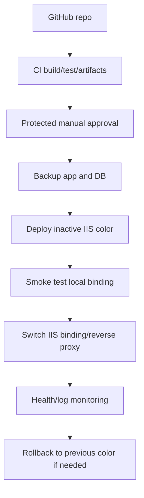

# DASH2A Architecture Assessment

This is a read-only assessment. No deploy, restart, server edit, migration, port change, workflow run, merge, or push was performed.

## Executive Summary

DASH2A currently looks like a traditional Windows/IIS VPS deployment with SQL Server on the same public host and a Firebase-hosted frontend. The minimum readiness documentation now exists, but the infrastructure is not yet safe for an automated backend deploy.

The modern target should be:
- GitHub Actions for build/test/artifacts only by default.
- Protected environments and manual approvals for deploy.
- Versioned immutable backend release folders.
- IIS blue/green or slot-like switching with fast rollback.
- Secrets outside the repo and outside logs.
- HTTPS termination, firewall hardening, and RDP lockdown.
- Explicit DB migration and rollback procedure before app switch.

## Known Infrastructure Map

| Area | Current finding | Evidence/status |
| --- | --- | --- |
| VPS | OVH `Back-end Dashboard`, `vps-4ca306e8.vps.ovh.net` | OVH panel |
| Public IPv4 | `51.83.159.175` | OVH panel and probes |
| OS | Windows Server 2025 Standard (Desktop) | OVH panel |
| Region | `os-waw2`, Warsaw | OVH panel |
| Backup | OVH automatic backup Standard, snapshot disabled | OVH panel; restore not tested |
| Web server | IIS 10 | RDP screenshots and HTTP header |
| Candidate IIS sites | `Default Web Site`, `demopapp` | RDP screenshots |
| Candidate App Pool | `demopapp` | RDP screenshots |
| Candidate deploy path | `C:\inetpub\wwwroot\publish` | RDP screenshots |
| SQL | SQL Server present, `SQLEXPRESS` running, SQL Browser running | RDP screenshots |
| Public HTTP | Port `80` open, IIS responds | TCP/HTTP probe |
| Public HTTPS | Port `443` timed out on IP | TCP/HTTP probe |
| Public SQL | Port `1433` open | TCP probe |
| Public RDP | Port `3389` open | TCP probe |
| WinRM | Ports `5985`/`5986` not open | TCP probe |
| SSH | Port `22` not open | TCP probe |
| Frontend hosting | Firebase project `eugenio-dashboard-2` | Repo config |
| Frontend public URL | `https://eugenio-dashboard-2a.web.app` | Repo docs and HTTP probe |

## GitHub / CI-CD Inventory

Active workflows currently registered on GitHub:

| Workflow | Path | Trigger | Risk |
| --- | --- | --- | --- |
| `DASH2A RDP Readiness` | `.github/workflows/dash2a-rdp-readiness.yml` on `main` | `workflow_dispatch` only | Readiness-only; does not connect to server |
| `Firebase Hosting Preview` | `.github/workflows/firebase-hosting-pull-request.yml` | PR workflow | Build-only behavior observed on PR branch |

Repository-level findings:
- No self-hosted runners returned by GitHub API.
- No webhooks returned by GitHub API.
- No deployments returned by GitHub API.
- Actions are enabled with `allowed_actions: all`.
- Only GitHub Actions secret name observed: `DASH2A_RDP_PASSWORD`.

Important branch note:
- `dash2a-rdp-readiness.yml` is registered from `main`, but it is not present in the local `feature/mobile-financial-reports` branch at assessment time.

## RDP Readiness Workflow Review

The registered workflow content was read from `main`.

Confirmed:
- Uses `workflow_dispatch` only.
- Requires manual input `I_UNDERSTAND_NO_DEPLOY`.
- Uses `permissions: contents: read`.
- Runs on GitHub-hosted `ubuntu-latest`.
- Checks only whether `DASH2A_RDP_PASSWORD` exists.
- Does not print the secret value.
- Does not connect to RDP.
- Does not deploy.
- Does not restart IIS/server.
- Does not edit server files.
- Does not run remote scripts.

Forbidden items not found in operative workflow behavior:
- `mstsc`
- `xfreerdp`
- `ssh`
- PowerShell remoting
- `psexec`
- runtime password use

The only `restart` text found is a printed guardrail statement: `No server restart will be executed.`

## Runtime / Server Architecture

Current observed runtime:
- IIS hosts at least `Default Web Site` and `demopapp`.
- `demopapp` uses App Pool `demopapp`.
- `demopapp` physical path appears to be `C:\inetpub\wwwroot\publish`.
- `Default Web Site` appears to point to the same publish path via `%SystemDrive%\inetpub\wwwroot\publish`.
- API endpoint `http://51.83.159.175/api/Auth/test` returns `200` via `Microsoft-IIS/10.0`.
- Root `/` and `/health` return `404`, so healthcheck contract is not standardized yet.

Known from repo:
- WebApi local port is `5299`.
- Frontend workflows build with `VITE_API_BASE_URL=http://51.83.159.175`.
- WebApi uses SQL Server via `ConnectionStrings:DefaultConnection`.
- `Program.cs` calls `UseHttpsRedirection()`, but public HTTPS on the IP did not respond during probe.

Unknown / still needs read-only confirmation:
- IIS binding table for each site.
- Whether `demopapp` is the actual DASH2A WebApi or a legacy/default publish folder.
- App Pool .NET CLR mode, identity, start mode, idle timeout, recycling settings.
- Whether Kestrel is behind IIS in-process/out-of-process.
- Actual log folder and stdout log configuration.
- Environment variable source.
- Actual DB name in runtime config.
- Firewall rules at Windows and OVH layers.
- Certificate location and HTTPS binding, if any.
- Windows Services / Scheduled Tasks related to DASH2A.
- SQL backup location and restore procedure.

## Public Exposure

Observed externally:

| Port | Result | Interpretation |
| --- | --- | --- |
| 80 | Open | IIS HTTP exposed |
| 443 | Timeout | HTTPS not responding on IP during probe |
| 1433 | Open | SQL Server exposed publicly |
| 3389 | Open | RDP exposed publicly |
| 5985 | Timeout/closed | WinRM HTTP not available |
| 5986 | Timeout/closed | WinRM HTTPS not available |
| 22 | Timeout | SSH not available |
| 445 | Timeout | SMB not available externally |
| 5000/5001/5299/8080 | Timeout | App dev ports not publicly exposed |

Primary security concern:
- Public SQL `1433` and public RDP `3389` are high-risk. Keep them only if locked down by OVH firewall / Windows firewall IP allowlists and strong credentials. Prefer VPN, bastion, or Just-in-Time access.

## Fragile Points

Blocking fragilities before any backend deploy:
- No tested app-level backup.
- No tested DB backup/restore.
- No tested rollback from `C:\inetpub\wwwroot\publish`.
- No standardized health endpoint.
- GitHub Actions backend deploy path is not designed yet.
- RDP is the only remote control path; WinRM is closed and should not be enabled casually.
- Secrets are still present in versioned appsettings files and need cleanup/rotation.
- EF migration state is partial and must be fixed/validated before production schema change.
- HTTPS/certificates are not confirmed.
- SQL Server appears publicly reachable.
- RDP appears publicly reachable.
- No centralized logs or monitoring identified.

## Modernization Plan

### Phase 1: Stabilize Current IIS Deployment

Goals:
- Do not change architecture yet.
- Make current setup observable and recoverable.

Actions:
- Complete read-only IIS inventory: sites, bindings, App Pools, physical paths, identities, logs.
- Record the exact active app folder and current deployed build.
- Add a real app health endpoint contract or identify existing API health endpoint.
- Remove/rotate versioned secrets and move production values to server env/app settings.
- Establish DB backup and app folder backup with restore verification.
- Confirm Windows firewall and OVH firewall allowlists.

### Phase 2: Safe Release Layout

Use release folders instead of copying directly into the active folder:

```text
C:\inetpub\dash2a\
  releases\
    20260524-001\
    20260524-002\
  current -> releases\20260524-002
  shared\
    logs\
    env\
    backups\
```

For IIS on Windows, if symlinks/junctions are acceptable:
- Bind IIS physical path to `C:\inetpub\dash2a\current`.
- Deploy new builds to `releases\<release-id>`.
- Smoke test release locally before switching.
- Switch `current` atomically.
- Recycle only the target App Pool during an approved deploy window.

If symlinks are not acceptable:
- Use blue/green folders and two IIS applications/sites.

### Phase 3: Blue/Green IIS Strategy

Recommended pattern:
- `dash2a-blue` App Pool and folder.
- `dash2a-green` App Pool and folder.
- One active IIS site binding routes public traffic to active color.
- Deploy to inactive color.
- Warm inactive color on local binding/port.
- Run DB compatibility checks.
- Switch binding or reverse proxy route.
- Keep previous color for rollback.

Benefits:
- Fast rollback.
- Reduced downtime.
- Avoids overwriting the only working folder.

Risk:
- Database migrations must be backward-compatible, or blue/green cannot be truly zero-downtime.

### Phase 4: CI/CD Serious Path

Start with CI, not deploy:
- Backend build/test workflow.
- Frontend build workflow.
- EF migration script generation artifact.
- Artifact upload for WebApi publish output.

Then protected deploy:
- GitHub Environment `production` with required reviewers.
- Manual `workflow_dispatch` only.
- No deploy on push.
- Deployment job gated by explicit confirmation input.
- Secrets scoped to environment.
- Concurrency lock: one deploy at a time.
- Dry-run/readiness job before deploy job.
- Deploy job should not print secrets.

Avoid:
- RDP automation as the long-term deploy mechanism.
- Passing passwords on CLI.
- Unprotected workflow on `push`.
- Enabling WinRM broadly on public internet.

### Phase 5: Observability And Recovery

Add:
- Structured application logs to file plus retention.
- Windows Event Log monitoring for IIS/.NET failures.
- Uptime check against a real health endpoint.
- Disk free alert.
- SQL backup success alert.
- Deployment record per release: commit, artifact hash, migration ID, backup path, rollback path.

## Recommended Target Architecture



## Safe Deploy Strategy

Minimum viable safe deploy:
1. Build artifact in CI.
2. Generate migration script artifact.
3. Manual approval.
4. DB backup verified.
5. App backup verified.
6. Copy artifact to inactive folder.
7. Apply only reviewed migration.
8. Switch IIS route/App Pool.
9. Smoke test.
10. Keep previous release ready.

Do not use automatic backend deployment until:
- Server inventory is complete.
- Secrets are cleaned/rotated.
- Healthcheck exists.
- Backup/rollback is tested.
- Firewall exposure is reduced.
- Migration strategy is fixed.

## Next Read-Only Inventory Needed

From RDP/IIS GUI or a safe read-only script:
- `Sites` table with bindings and physical paths.
- `Application Pools` with CLR mode, identity, start mode, idle/recycle settings.
- `web.config` from active folder with secrets masked.
- Disk free screenshot/output.
- Windows firewall inbound rules relevant to 80/443/1433/3389.
- SQL Server instance/database list and backup settings.
- Scheduled Tasks filtered for DASH2A/Eugenio/WebApi.
- Windows Services filtered for dashboard/dotnet/webapi.

Until then, backend deploy remains blocked.
